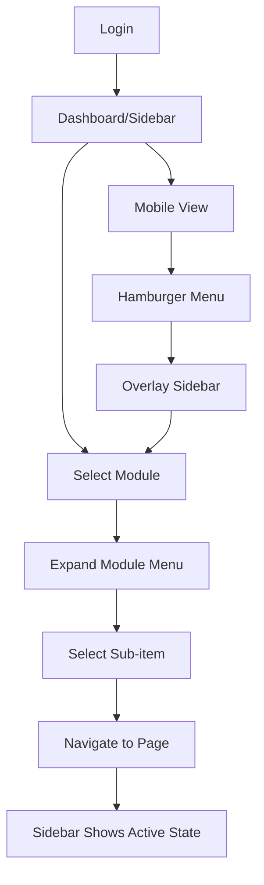

# Corporate Web App Sidebar Redesign - Product Requirements Document

## 1. Product Overview

This project involves redesigning the corporate web application sidebar to improve user experience, modernize the visual design, and enhance navigation efficiency based on the Figma design specifications. The new sidebar will maintain all existing functionality while introducing a more intuitive and visually appealing interface that aligns with modern corporate design standards.

The redesign aims to solve navigation complexity issues, improve visual hierarchy, and provide better user engagement through enhanced UI/UX patterns while maintaining the existing modular structure for Aid Management, Donation Management, Message Management, and other core modules.

## 2. Core Features

### 2.1 User Roles

The sidebar maintains the existing role-based access system without modification:

| Role | Registration Method | Core Permissions |
|------|---------------------|------------------|
| Admin User | System administrator assignment | Full access to all modules and system settings |
| Module Manager | Department-based assignment | Access to specific modules (Aid, Donations, Messages, etc.) |
| Regular User | Standard employee registration | Limited access based on department and role |

### 2.2 Feature Module

Our corporate sidebar redesign consists of the following main components:

1. **Header Section**: Logo area, user profile, and global actions
2. **Navigation Menu**: Hierarchical menu structure with expandable sections
3. **Module Sections**: Organized groupings for different business functions
4. **Footer Section**: System information and quick settings
5. **Mobile Responsive Layout**: Collapsible sidebar for mobile devices

### 2.3 Page Details

| Component Name | Module Name | Feature Description |
|----------------|-------------|--------------------|
| Header Section | Logo & Branding | Display company logo, application title "Dernek Paneli", and maintain brand consistency |
| Header Section | User Profile | Show user avatar, name, role indicator, and quick profile access |
| Navigation Menu | General Section | Provide access to Home, Analytics Dashboard, and Security Settings |
| Navigation Menu | Collaboration Section | Include Meetings, Internal Messages, and Tasks with notification badges |
| Navigation Menu | Modules Section | Organize expandable sections for Fund Management, Donation Management, Message Management, Scholarship Management, Aid Management, Definitions, and System modules |
| Navigation Menu | Expandable Items | Implement smooth expand/collapse animations with chevron indicators |
| Navigation Menu | Active States | Highlight current page with visual indicators and breadcrumb context |
| Footer Section | System Info | Display version information, system status, and quick settings access |
| Mobile Layout | Responsive Design | Transform to overlay/drawer pattern on mobile devices with touch-friendly interactions |
| Mobile Layout | Gesture Support | Support swipe gestures for opening/closing sidebar on mobile |

## 3. Core Process

### Main User Navigation Flow

1. **Initial Access**: User logs in and sees the sidebar in its default state with collapsed expandable sections
2. **Module Navigation**: User clicks on a module section (e.g., "Bağış Yönetimi") to expand and view sub-items
3. **Page Selection**: User selects a specific page from the expanded menu, which highlights the active state
4. **Context Awareness**: Sidebar maintains the expanded state of the current module and highlights the active page
5. **Mobile Interaction**: On mobile devices, sidebar appears as an overlay that can be toggled via hamburger menu

### Admin Flow

1. **Full Access**: Admin users see all modules and have access to system management sections
2. **User Management**: Access to user management and system configuration through the Definitions and System modules
3. **Monitoring**: View system status and analytics through dedicated dashboard sections

## 4. User Interface Design

### 4.1 Design Style

- **Primary Colors**: 
  - Brand Primary: `#0F3A7A` (Deep corporate blue)
  - Sidebar Background: `#111827` (Dark charcoal)
  - Active State: `#0F3A7A` (Brand primary)
- **Secondary Colors**:
  - Text Primary: `#F2F4F6` (Light gray)
  - Text Muted: `#9AA4B2` (Medium gray)
  - Hover State: `#1A2332` (Subtle dark blue)
- **Typography**: Inter font family for clean, professional appearance
- **Button Style**: Rounded corners (8px), subtle hover animations, clear focus states
- **Layout Style**: Vertical sidebar with card-based sections, clean spacing, and visual hierarchy
- **Icon Style**: Lucide React icons (16px) with consistent stroke width, professional appearance

### 4.2 Page Design Overview

| Component Name | Module Name | UI Elements |
|----------------|-------------|-------------|
| Header Section | Logo Area | Dark background `#111827`, white logo/text, 56px height, centered alignment |
| Header Section | User Profile | Avatar circle (32px), username in `#F2F4F6`, role badge with brand colors |
| Navigation Menu | Section Headers | Uppercase labels in `#9AA4B2`, 12px font size, medium spacing |
| Navigation Menu | Menu Items | 40px height, `#F2F4F6` text, hover background `#1A2332`, smooth transitions |
| Navigation Menu | Active States | Background `#0F3A7A`, white text, left border accent, bold font weight |
| Navigation Menu | Expandable Items | Chevron icons, smooth rotation animation, nested indentation for sub-items |
| Footer Section | System Info | Subtle background, small text, version display, settings icon |
| Mobile Layout | Overlay Design | Full-height overlay, backdrop blur, slide-in animation from left |

### 4.3 Responsiveness

The sidebar is designed with a desktop-first approach but includes comprehensive mobile adaptations:

- **Desktop (≥768px)**: Fixed sidebar (256px width) with full navigation visible
- **Tablet (768px-1024px)**: Collapsible sidebar that can be toggled, maintains full functionality
- **Mobile (<768px)**: Overlay/drawer pattern with hamburger menu trigger, touch-optimized interactions
- **Touch Optimization**: Minimum 44px touch targets, swipe gestures for mobile sidebar control
- **Accessibility**: Full keyboard navigation support, ARIA labels, screen reader compatibility