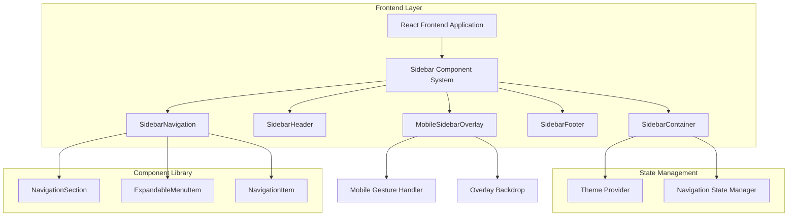

# Corporate Web App Sidebar Redesign - Technical Architecture Document

## 1. Architecture Design



## 2. Technology Description

- **Frontend**: React@18 + TypeScript + Tailwind CSS@3 + Vite
- **State Management**: Zustand (existing UI store)
- **Icons**: Lucide React
- **Animations**: Framer Motion + CSS Transitions
- **Routing**: React Router DOM
- **Styling**: CSS Custom Properties + Tailwind Utilities

## 3. Route Definitions

The sidebar integrates with the existing routing system without modifications:

| Route | Purpose |
|-------|---------|
| / | Home page, main dashboard |
| /analytics | Analytics dashboard with data visualization |
| /security/settings | Security configuration and settings |
| /meetings | Meeting management and scheduling |
| /internal-messages | Internal communication system |
| /tasks | Task management and tracking |
| /fund/* | Fund management module routes |
| /donations/* | Donation management module routes |
| /messages/* | Message management module routes |
| /scholarship/* | Scholarship management module routes |
| /aid/* | Aid management module routes |
| /definitions/* | System definitions and configurations |
| /system/* | System administration routes |

## 4. Component Architecture

### 4.1 Core Components

**SidebarContainer Component**
```typescript
interface SidebarContainerProps {
  isCollapsed?: boolean;
  onToggle?: () => void;
  variant?: 'desktop' | 'mobile';
}
```

**SidebarHeader Component**
```typescript
interface SidebarHeaderProps {
  logo?: string;
  title: string;
  user?: {
    name: string;
    role: string;
    avatar?: string;
  };
  isCollapsed?: boolean;
}
```

**NavigationSection Component**
```typescript
interface NavigationSectionProps {
  title: string;
  items: NavigationItem[];
  isCollapsed?: boolean;
  defaultExpanded?: boolean;
}

interface NavigationItem {
  id: string;
  to: string;
  label: string;
  icon: React.ReactNode;
  badge?: number;
  children?: NavigationItem[];
  permissions?: string[];
}
```

**ExpandableMenuItem Component**
```typescript
interface ExpandableMenuItemProps {
  item: NavigationItem;
  isExpanded: boolean;
  onToggle: (id: string) => void;
  isActive: boolean;
  level?: number;
}
```

### 4.2 State Management

**Sidebar State Interface**
```typescript
interface SidebarState {
  isCollapsed: boolean;
  isMobileOpen: boolean;
  expandedSections: string[];
  activeRoute: string;
  
  // Actions
  toggleCollapse: () => void;
  toggleMobile: () => void;
  toggleSection: (sectionId: string) => void;
  setActiveRoute: (route: string) => void;
  expandSection: (sectionId: string) => void;
  collapseSection: (sectionId: string) => void;
}
```

### 4.3 Theme Integration

**CSS Custom Properties**
```css
:root {
  /* Sidebar Specific Variables */
  --sidebar-width: 256px;
  --sidebar-collapsed-width: 64px;
  --sidebar-header-height: 56px;
  --sidebar-item-height: 40px;
  --sidebar-animation-duration: 0.3s;
  
  /* Color Variables (from existing system) */
  --sidebar-bg: var(--neutral-900);
  --sidebar-text: var(--neutral-50);
  --sidebar-text-muted: var(--neutral-400);
  --sidebar-hover: var(--neutral-800);
  --sidebar-active: var(--brand-primary);
  --sidebar-border: var(--neutral-700);
}
```

## 5. Implementation Plan

### 5.1 Phase 1: Core Component Structure
1. Create new `SidebarV2` component alongside existing sidebar
2. Implement basic layout structure with header, navigation, and footer
3. Set up state management with Zustand store
4. Integrate with existing routing system

### 5.2 Phase 2: Navigation Logic
1. Implement expandable menu functionality
2. Add active state management based on current route
3. Create navigation item components with proper TypeScript interfaces
4. Add keyboard navigation support

### 5.3 Phase 3: Styling and Animations
1. Apply new design system colors and typography
2. Implement smooth expand/collapse animations
3. Add hover and focus states
4. Ensure accessibility compliance (ARIA labels, focus management)

### 5.4 Phase 4: Mobile Responsiveness
1. Create mobile overlay component
2. Implement gesture support for mobile interactions
3. Add backdrop and slide animations
4. Test touch interactions and swipe gestures

### 5.5 Phase 5: Integration and Testing
1. Replace existing sidebar with new implementation
2. Update DashboardLayout to use new sidebar
3. Test all navigation flows and state persistence
4. Performance optimization and bundle size analysis

## 6. File Structure

```
src/
├── components/
│   ├── sidebar/
│   │   ├── SidebarContainer.tsx
│   │   ├── SidebarHeader.tsx
│   │   ├── SidebarNavigation.tsx
│   │   ├── SidebarFooter.tsx
│   │   ├── NavigationSection.tsx
│   │   ├── ExpandableMenuItem.tsx
│   │   ├── NavigationItem.tsx
│   │   ├── MobileSidebarOverlay.tsx
│   │   └── index.ts
│   └── ...
├── hooks/
│   ├── useSidebarNavigation.ts
│   ├── useMobileDetection.ts
│   └── ...
├── store/
│   ├── sidebarStore.ts
│   └── ...
├── types/
│   ├── navigation.ts
│   └── ...
└── styles/
    ├── sidebar.css
    └── ...
```

## 7. Performance Considerations

### 7.1 Optimization Strategies
- **Lazy Loading**: Load navigation items dynamically based on user permissions
- **Memoization**: Use React.memo for navigation items to prevent unnecessary re-renders
- **Virtual Scrolling**: Implement for large navigation lists if needed
- **Bundle Splitting**: Separate mobile and desktop sidebar code

### 7.2 Animation Performance
- Use CSS transforms instead of changing layout properties
- Implement `will-change` property for animated elements
- Use `transform3d` for hardware acceleration
- Debounce resize events for responsive behavior

## 8. Accessibility Requirements

### 8.1 WCAG 2.1 AA Compliance
- **Keyboard Navigation**: Full keyboard support with proper focus management
- **Screen Readers**: ARIA labels and landmarks for navigation structure
- **Color Contrast**: Minimum 4.5:1 contrast ratio for all text elements
- **Focus Indicators**: Clear visual focus indicators for all interactive elements

### 8.2 Implementation Details
- Use semantic HTML elements (`nav`, `ul`, `li`)
- Implement proper ARIA attributes (`aria-expanded`, `aria-current`)
- Provide skip links for keyboard users
- Support high contrast mode and reduced motion preferences

## 9. Testing Strategy

### 9.1 Unit Testing
- Component rendering tests with React Testing Library
- State management tests for sidebar store
- Navigation logic tests
- Accessibility tests with jest-axe

### 9.2 Integration Testing
- Route navigation testing
- Mobile responsive behavior testing
- Cross-browser compatibility testing
- Performance testing with Lighthouse

### 9.3 User Acceptance Testing
- Navigation efficiency testing
- Mobile usability testing
- Accessibility testing with screen readers
- Visual regression testing